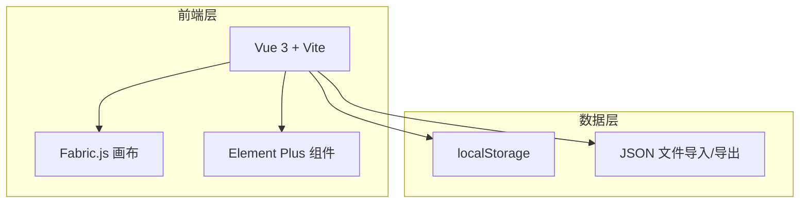

## 1. 架构设计



## 2. 技术说明

- 前端框架：Vue 3 + Vite（Composition API，不使用 TypeScript）
- 画布引擎：Fabric.js（唯一的图形库，负责画布渲染和标注操作）
- UI组件库：Element Plus（仅使用 Upload 上传组件和 Message 消息提示）
- 本地存储：localStorage（存储标注数据，替代 IndexedDB）
- 文件导出：FileSaver.js（导出 JSON 文件）
- 状态管理：Vue 的 reactive（无状态管理库）
- 样式方案：原生 CSS + CSS Variables
- 初始化工具：vite-init
- 开发端口：5890

## 3. 路由定义

| 路由 | 用途 |
|------|------|
| / | 标注画布主页面（单页应用，仅一个页面） |

## 4. 项目目录结构

```
src/
├── App.vue                 # 根组件
├── main.js                 # 入口文件
├── components/
│   ├── TopBar.vue          # 顶部操作栏（上传、导入导出、清空）
│   ├── ToolBar.vue         # 左侧标注工具栏
│   ├── CanvasArea.vue      # 中央画布区域
│   └── PropertyPanel.vue   # 右侧属性面板
├── composables/
│   ├── useCanvas.js        # 画布初始化与操作逻辑
│   ├── useRectangle.js     # 矩形绘制逻辑
│   ├── usePolygon.js       # 多边形绘制逻辑
│   ├── useTextTool.js      # 文本添加逻辑
│   ├── useCanvasZoom.js    # 缩放与平移逻辑
│   └── useAnnotationData.js # 标注数据管理逻辑
└── utils/
    ├── storage.js          # localStorage 操作封装
    └── export.js           # JSON 导入导出工具函数
```

## 5. 核心数据结构

### 5.1 标注数据模型

```javascript
{
  version: "1.0",
  imageUrl: "base64字符串或文件名",
  canvasWidth: 1920,
  canvasHeight: 1080,
  annotations: [
    {
      id: "uuid",
      type: "rect | polygon | text",
      label: "标注文本",
      color: "#06b6d4",
      coordinates: {
        // 矩形: { x, y, width, height }
        // 多边形: { points: [{x, y}, ...] }
        // 文本: { x, y }
      },
      createdAt: "ISO时间戳",
      updatedAt: "ISO时间戳"
    }
  ]
}
```

### 5.2 画布状态模型

```javascript
{
  activeTool: "select | rect | polygon | text",
  zoomLevel: 1,
  isPanning: false,
  selectedAnnotation: null,
  isDrawing: false
}
```
